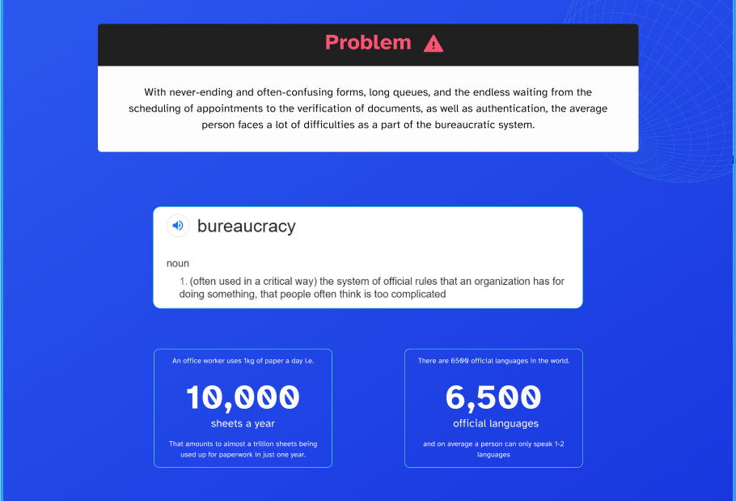
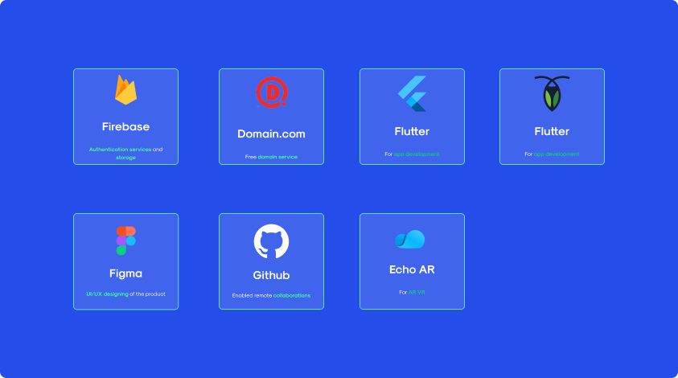

# GloID


> GloID - The only ID you will ever need.

## What is GloID?

GloID is a single monoauth management super application integrating the power of modern tech and AR/VR technology to make this process simpler and faster for humans worldwide.

On registration, the app assigns a unique identity to the user that acts as a one-stop authentication of the user globally, significantly reducing the requirement for paper documents and countless ID cards that an individual has to carry.

## Aim



### Solution

- Provide easy way to fill form to prevent language barrier
- Provide a decentralised auth sytem gliobally to reduce hassle of document
- Provide Users Data Control and see where and whom thier data is being accesssed by
- AR Illustration of location of Organisation that access thier data.

Important Links:

- [Website](https://gloid-tidy-you.space)
- [Figma File](https://www.figma.com/file/5prt13dFrsuNytqVg2VL3H/GloID?node-id=1%3A3)
- [Echo AR](https://github.com/hsrambo07/gloID/tree/main/echoAR)

## Techstack




- Flutter - The whole App was made on Flutter
- Cockroach DB - Easy to access and maintained SQL Hosting
- Echo AR - AR Deployment Provider
- Figma - All the designs and prototypes were made on Figma
- Firebase - For two factor authentication
- Domain.com - Domain Provider

## Getting started

### Flutter App

```bash
git clone https://github.com/hsrambo07/gloID
cd flutter_app
pub get
flutter build apk
```

### GloID Server

```bash
git clone https://github.com/hsrambo07/gloID
cd gloid_server
yarn install
yarn dev
```

## Contributing


## Authors
<!-- ALL-CONTRIBUTORS-LIST:START - Do not remove or modify this section -->
<!-- prettier-ignore-start -->
<!-- markdownlint-disable -->
<table>
	<tr>
		<td align="center">
			<a href="https://github.com/DarthBenro008"><br /><sub><b>Hemanth Krishna</b></sub></a><br /> <a href="https://github.com/hsrambo07/gloID/commits?author=DarthBenro008" title="Documentation">📖 <a href="https://github.com/hsrambo07/gloID/commits?author=DarthBenro008" title="Code"> 💻 </a><a href="#infra-DarthBenro008" title="Infrastructure (Hosting, Build-Tools, etc)"> 🚇 </a>
		</td>
  <td align="center">
			<a href="https://github.com/Chronomyst"><br /><sub><b>Khyati Gupta</b></sub></a><br /> <a href="https://github.com/hsrambo07/gloID/commits?author=r-ush" title="Documentation">📖 <a href="https://github.com/hsrambo07/gloID/commits?author=Chronomyst" title="Code"> 💻 </a><a href="#infra-r-ush" title="Infrastructure (Hosting, Build-Tools, etc)"> 🚇 </a>
		</td>
  <td align="center">
			<a href="https://github.com/hsrambo07"><br /><sub><b>Harsh Singhal</b></sub></a><br /> <a href="https://github.com/hsrambo07/gloID/commits?author=r-ush" title="Documentation">📖 <a href="https://github.com/hsrambo07/gloID/commits?author=r-ush" title="Code"> 💻 </a><a href="#infra-r-ush" title="Infrastructure (Hosting, Build-Tools, etc)"> 🚇 </a>
		</td>
         <td align="center">
			<a href="https://github.com/shriyashish"><br /><sub><b>Shriyashish Mishra</b></sub></a><br /> <a href="https://github.com/hsrambo07/gloID/commits?author=shriyashish" title="Documentation">📖 <a href="https://github.com/hsrambo07/gloID/commits?author=shriyashish" title="Code"> 💻 </a><a href="#infra-r-ush" title="Infrastructure (Hosting, Build-Tools, etc)"> 🚇 </a>
		</td>
	</tr>
</table>

<br />

