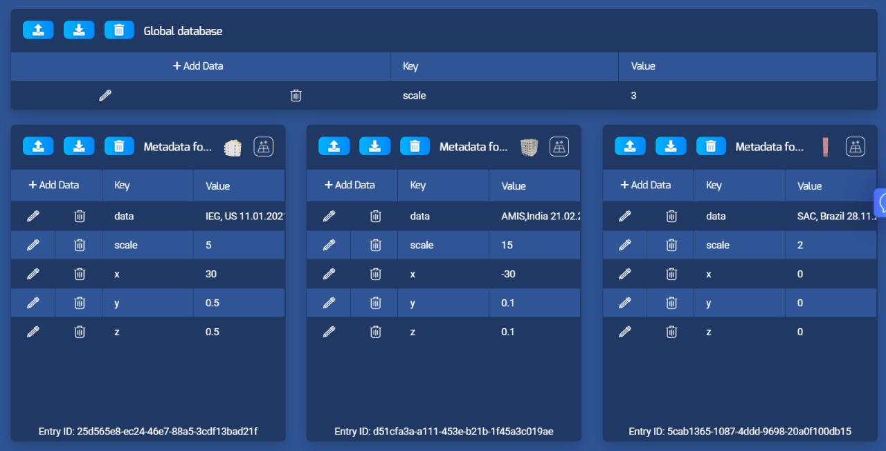

# Echo AR Usage

We have used AR Technology with EchoAR+ARFoundation+Unity to find out the transaction history of data between the user and the organisations. Using the meta data on EchoAR Cloud, we projected the transaction information and we also used the 3D models from the cloud itself. 
Problems faced: The version of the sample SDK file provided by EchoAR wasn't working with the newly updated versions of Unity due to files override issues.

